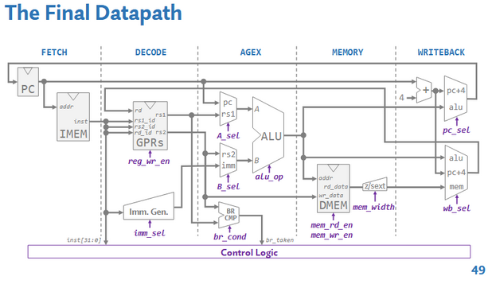

# 64-bit RISC-V Single-Cycle CPU

Designed and implemented a 64-bit single-cycle RISC-V CPU in SystemVerilog, supporting a subset of the RV64I instruction set and verified through simulation.

## Overview
This project implements a 64-bit RISC-V processor from scratch using a single-cycle architecture. The design includes a complete datapath and control unit capable of executing assembly programs compiled into machine code.

## Key Features
- 64-bit RISC-V CPU supporting a subset of RV64I instructions
- Single-cycle architecture with full datapath and control logic
- Custom ALU implementation using a **Kogge-Stone adder** for fast addition
- Modular design including:
  - ALU
  - Register file
  - Instruction memory
  - Control unit
- Simulation and verification using test programs

## Architecture
The CPU follows a standard single-cycle RISC-V design:
- Instruction fetch → decode → execute → memory → write-back
- Control signals drive datapath behavior for each instruction type



## How to Run

### 1. Assemble Program
Use RARS to assemble your program and dump machine code:

```bash
java -jar rars.jar nc a tests/branch.asm dump .text HexText projmem.hex
```
### 2. Simulate CPU
```bash
iverilog -g2012 -c sources1.txt -o cpu
vvp cpu
